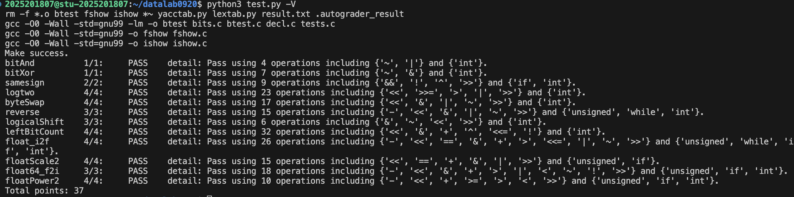

# datalab 报告

姓名：周文琪

学号：2025201807

| 总分  | bitAnd | bitXor | samesign | logtwo | byteSwap | reverse | logicalShift | leftBitCount | float_i2f | floatScale2 | float64_f2i | floatPower2 |
| --- | ------ | ------ | -------- | ------ | -------- | ------- | ------------ | ------------ | --------- | ----------- | ----------- | ----------- |
| 37  | 1      | 1      | 2        | 4      | 4        | 3       | 3            | 4            | 4         | 4           | 3           | 4           |


test 截图：


## 解题报告

### 亮点
前两题在下面题目解析的格式不一样因为是我提前写的。
##### 1、float_i2f
题目处理：首先将int提取符号，整体转换为unsigned。因为二进制整数和浮点数的负数表示不相同，不可以直接解释。
主要思路：提取sign-转非负数-处理零边界-找exp阶数-处理尾数进位情况-符号｜阶码｜尾数拼接。
主要亮点：找exp阶数时，我没有直接从尾找阶码，而是从最高位处理，找到第一个出现1的位置。实际阶数等于31-exp，但在代码内我没有直接求解。
由于输入肯定为正数，是规格化书，最高阶次为31，这样处理相对方便。
```c
while((ux&0x80000000)==0){ // 找第一个出现的1前面的位数. 10
    ux<<=1;//11
    exp=exp+1;//12
}
ux<<=1;//13
```
ux此时就是去掉隐藏位的尾数。之后求阶码时，由于bias=127，实际阶数为31-exp，所以可以直接一步到位求(158-exp)<<23得到阶码。

##### 2、float64_f2i
题目处理：两个输入的主要构成为：uf1-后32位尾数，uf2-符号位+11位阶码+前20位尾数。从浮点数转换到正数需要先全部按照正数处理，之后依照符号位看情况处理最小边界/取反。由于本题直接向零取整且超位/不足直接返回0x80000000/0，处理相对简单。
主要思路：提取符号位-提取bias+exp-判断int是否可保存处理边界-拼接最多保存尾数-处理exp最大，exp == 31的特殊情况-拼接符号位｜阶码｜尾数。
主要亮点：拼接最多保存尾数是一个对尾数的前置处理，由于题目向零取证，此处理成立。
```c
unsigned tail=0x80000000|(uf2&0xfffff)<<11|(uf1>>21);
```
由于最高能保存阶数为31，对应的的尾数范围内就是（隐藏位1+uf2的20位尾数+uf1补充11位）。之后可以直接整体移动，不需要分别处理uf1和uf2。

##### 3、leftbitcount和logtwo
两题处理类似，由老师的ppt启发想法。

##### 4、floatScale2


<!-- 告诉助教哪些函数是你实现得最优秀的，比如你可以排序。不需要展开，展开请放到后文中。 -->


### bitXor

```c
return (~(~x & ~y))&(~(x & y));
```

思路：or和and结果相对所以or其实就是and类似的操作，and取反11-0，01-1，10-1，00-1。or结果11-1，10-1，01-1，00-0。两者取and就是异或。

### samesign

```c
if (!(x&&y)){
	if ((!x)&&(!y)){
		return 1;
	}
else{
	return 0;
	}
}
return (!((x>>31) ^ (y>>31)));
```

思路：先把带零的全处理了，00同号其他全不同，之后通过右移31位做比较即可。

### logtwo

```c
int b16=((v>>16)>0)<<4;
v>>=b16;
int b8=((v>>8)>0)<<3;
v>>=b8;
int b4=((v>>4)>0)<<2;
v>>=b4;
int b2=((v>>2)>0)<<1;
v>>=b2;
int b1=((v>>1)>0);
v>>=b1;
return b16|b8|b4|b2|b1;
```

思路：本题实际上是取2的最大幂次，就是取二进制表示的最左位1。所以以16-8-4-2-1。由于幂次实际上是最高位位置-1（从1开始数）。所以区别于另外一个用类似解法的题目。

### byteSwap

```c
int nstep=(n<<3);
int mstep=(m<<3);
int n1=(0xFF<<nstep);
int m1=(0xFF<<mstep);
int stay=((x&(~(n1|m1))));
int n_shft=(((x&n1)>>nstep)<<mstep)&m1;
int m_shft=(((x&m1)>>mstep)<<nstep)&n1;
return (stay|n_shft|m_shft);
```

思路：由于一个byte是8位，所以先把n和m分别乘8得到对应byte的移动位数。之后用0xFF生成两个mask，把需要交换的两个byte分别取出来，同时把原位置清零。最后把两个byte移动到对方的位置，再和剩下不变的部分做or拼回去即可。

### reverse

```c
int time=16;
unsigned mask=0x1;
while(time){
    time=time-1;
    int step1=time;
    int step2=31-time;
    unsigned t1=(mask<<step1);
    unsigned t2=(mask<<step2);
    unsigned right=(((v&t1)>>step1)<<step2);
    unsigned left=(((v&t2)>>step2)<<step1);
    v=((v&~(t1|t2))|right|left);
}
return v;
```

思路：32位完全翻转实际上就是交换左右对称位置的bit，一共需要交换16组。每一次根据step1和step2生成两个只有对应位置为1的mask，把这两个bit分别提取出来，清除原位置，再交换到对方的位置。循环16次之后就完成整个32位的翻转。

### logicalShift

```c
int mask=~(((1<<31)>>n)<<1);
return (x>>n)&mask;
```

思路：本题的问题主要是有符号整数右移默认是算术右移，如果x是负数，左边会自动补1。所以先正常右移，再生成一个mask，把右移之后左边补进来的这些1全部清零，就可以得到逻辑右移的结果。

### leftBitCount

```c
int count=0;
int b16=!((x&0xffff0000)^0xffff0000)<<4;
x<<=b16;
int b8=!((x&0xff000000)^0xff000000)<<3;
x<<=b8;
int b4=!((x&0xf0000000)^0xf0000000)<<2;
x<<=b4;
int b2=!((x&0xc0000000)^0xc0000000)<<1;
x<<=b2;
int b1=!((x&0x80000000)^0x80000000);
x<<=b1;
int b0=!((x&0x80000000)^0x80000000);
count=b16+b8+b4+b2+b1+b0;
return count;
```

思路：和logtwo类似，也采用16-8-4-2-1的方式逐步缩小范围。但是logtwo是在找最左边1的位置，本题是在判断左边连续有多少个1，所以本题比logtwo多一个b0。所以每次判断最左边对应长度的一段是不是全1，如果是，就把这一段直接左移出去并把长度记录下来，然后继续判断后面的部分。最后把每次确定为全1的长度加起来即可。


### float_i2f
```c
unsigned sign=x&0x80000000;
unsigned ux=x;
if (sign==0x80000000){
    ux=~(ux-1);
}
unsigned exp=0;
if(ux==0){
    return 0;
}
while((ux&0x80000000)==0){
    ux<<=1;
    exp=exp+1;
}
ux<<=1;
unsigned tail=ux&0x000001ff;
if((tail>0x00000100)+((tail==0x00000100)&((ux&0x00000200)>>9))){
    if((ux&0xfffffe00)==0xfffffe00){
        exp=exp-1;
    }
    ux=ux+0x00000200;
}
ux=(ux>>9);
exp=158-exp;
ux=(sign|(exp<<23)|ux);
return ux;
```

题目处理：首先将int提取符号，整体转换为unsigned。因为二进制整数和浮点数的负数表示不相同，不可以直接解释。
主要思路：提取sign-转非负数-处理零边界-找exp阶数-处理尾数进位情况-符号｜阶码｜尾数拼接。
主要亮点：找exp阶数时，我没有直接从尾找阶码，而是从最高位处理，找到第一个出现1的位置。实际阶数等于31-exp，但在代码内我没有直接求解。
```c
while((ux&0x80000000)==0){ // 找第一个出现的1前面的位数. 10
    ux<<=1;//11
    exp=exp+1;//12
}
ux<<=1;//13
```

由于输入肯定为正数，是规格化书，最高阶次为31，这样处理相对方便。ux此时就是去掉隐藏位的尾数。之后求阶码时，由于bias=127，实际阶数为31-exp，所以可以直接一步到位求(158-exp)<<23得到阶码。


### floatScale2

```c
unsigned sign=uf&0x80000000;
unsigned exp=(uf>>23)&0xff;
unsigned frac=uf&0x7fffff;
if(exp==0xff){
    return uf;
}
if(exp==0){
    frac=frac<<1;
    if(frac&0x800000){
        exp=exp+1;
        frac=frac&0x7fffff;
    }
}
else{
    exp=exp+1;
    if(exp==0xff){
        frac=0;
    }
}
uf=(sign|(exp<<23)|frac);
return uf;
```

思路：这题实际上就是根据float的不同类型分类处理乘2。NaN和无穷直接返回。对于非规格化数，因为阶码不能直接+1，所以直接把尾数左移一位，如果最高位被移到规格化数隐藏1的位置，就说明它变成了规格化数，此时阶码变成1并去掉这一位。对于规格化数，乘2就是阶码+1，如果阶码变成0xff，说明结果溢出成为无穷，同时尾数清零。

### float64_f2i

```c
unsigned sign=uf2>>31;
unsigned exp=((uf2>>20)&0x7ff);
if (exp<1023){
    return 0;
}
exp=exp-1023;
unsigned tail=0x80000000|(uf2&0xfffff)<<11|(uf1>>21);
if (exp>30){
    if (exp>31){
        return 0x80000000;
    }
    else{
        if (!sign){
            return 0x80000000;
        }
        else{
            if(tail>0x80000000){
                return 0x80000000;
            }
        }
    }
}
unsigned result=tail>>(31-exp);
if (sign){
    result=~result+1;
}
return result;
```

题目处理：两个输入的主要构成为：uf1-后32位尾数，uf2-符号位+11位阶码+前20位尾数。从浮点数转换到正数需要先全部按照正数处理，之后依照符号位看情况处理最小边界/取反。由于本题直接向零取整且超位/不足直接返回0x80000000/0，处理相对简单。
主要思路：提取符号位-提取bias+exp-判断int是否可保存处理边界-拼接最多保存尾数-处理exp最大，exp == 31的特殊情况-拼接符号位｜阶码｜尾数。
主要亮点：拼接最多保存尾数是一个对尾数的前置处理，由于题目向零取证，此处理成立。
```c
unsigned tail=0x80000000|(uf2&0xfffff)<<11|(uf1>>21);
```

由于最高能保存阶数为31，对应的的尾数范围内就是（隐藏位1+uf2的20位尾数+uf1补充11位）。之后可以直接整体移动，不需要分别处理uf1和uf2。


### floatPower2

```c
int bias=127;
if(x>127){
    return 0x7f800000;
}
if(x>=-126){
    return (x+bias)<<23;
}
if(x<-149){
    return 0;
}
return (0x00800000>>(-126-x));
```

思路：因为要求的是\(2^x\)，符号位一定为0，而且有效数字始终就是1，所以这题主要处理阶码范围即可。如果x在`-126~127`之间，可以直接作为规格化数，把实际指数加bias之后放进阶码。如果x>127，结果超过float范围，直接返回正无穷。如果x<-126但仍然不小于-149，说明结果属于非规格化数，这时阶码为0，通过把尾数最高位不断右移表示更小的2的幂。如果小于-149，连最小非规格化数都无法表示，直接返回0。


## 反馈/收获/感悟/总结

<!-- 这一节，你可以简单描述你在这个 lab 上花费的时间/你认为的难度/你认为不合理的地方/你认为有趣的地方 -->
花费了五天，下课时间每天写几题之后写完的。我觉得熟悉之后难度不高，浮点数操作比较类似，主要都是依靠IEEE754，重点在于代码的实现。
<!-- 或者是收获/感悟/总结 -->
收获是我对IEEE754理解更深刻，整个lab几个坑点都在小数处理上。包括int右移补位问题，nan、规格化数、非规格化数相互转换的问题，还有就近1取偶的处理问题等。都是需要重点注意的边界问题。
另外一个就是用有限操作符表示目的操作的训练。我一开始非常想用break，包括题目里没给的其他操作符，最后都是通过现有允许操作符组装叠加完成的。
<!-- 200 字以内，可以不写 -->

## 参考的重要资料

<!-- 有哪些文章/论文/PPT/课本对你的实现有重要启发或者帮助，或者是你直接引用了某个方法 -->

<!-- 请附上文章标题和可访问的网页路径 -->

没有参考别人的解法，只回顾了老师的3-encoding的ppt中的内容和例题用于思路启发。